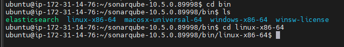
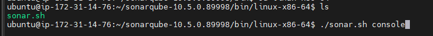

# sonarqube-instalation

1 Install JDK  

````
sudo apt install openjdk-17-jre
````

2 Download sonar-qube

````
wget https://binaries.sonarsource.com/Distribution/sonarqube/sonarqube-10.5.0.89998.zip
````

3 Download unzip tool to unzip the sonar

````
sudo apt install unzip
````

4 Unzip the sonar-qube

````
unzip sonarqube-10.5.0.89998.zip
````
Note :- unzip the file in path location

5 goto unzipped folder 

````
cd sonarqube-10.5.0.89998
````

6 goto bin folder find the file according to your system

````
cd bin
````



7 Enter below command to launch sonar ui

````
./sonar.sh console
````


